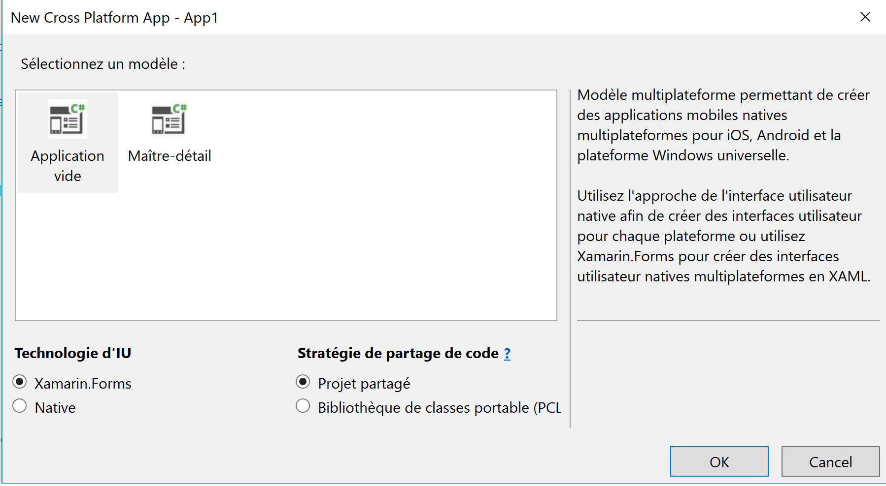

Notes

Créer un projet Xamarin Forms

Mettre à jour Xamarin Forms

Installer le package Nuget Xam.Plugin.Media -> V2.6.2 visiblement un probléme avec la version 3 et xamarin forms android

Installer le package Nuget  Windows Azure Storage

Deux options pour l'émulateur android 
Avec Hyper V installer https://www.visualstudio.com/fr/vs/msft-android-emulator
Sans Hyper V 
l'émulateur Android du sdk android
